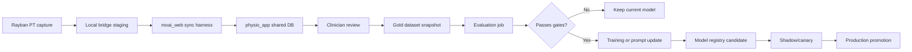

# Physio App Agentic MLOps Runbook

## North star

`rayban_pt` is a multimodal capture edge for `physio_app`.

The system of record is the shared `moai_web` Supabase project, not a separate long-lived Rayban PT database. The local SQLite bridge is staging, retry, and offline resilience only.

Current mode is `design/dry_run`. This runbook describes the frame agents will use later; it does not mean recurring sync or training should be enabled before data readiness gates are met.

See `docs/multimodal-data-contract-and-readiness.md` for the canonical object, label taxonomy v0, and readiness gates.
See `docs/pilot-capture-checklist.md` and `docs/pilot-session-manifest.template.json` for first pilot data collection.

## Shared database contract

Agents should treat these `moai_web` tables as the canonical operational surface:

| Concern | Canonical tables |
| --- | --- |
| Encounter identity | `encounters` |
| Media metadata | `encounter_media`, `voice_memos` |
| AI draft and trace | `ai_inference_log`, `agent_runs` |
| Structured findings | `observations`, `activity_sessions`, `client_media_summaries` |
| Clinical note | `encounter_notes` |
| Human review | `clinical_extraction_reviews`, `ai_feedback` |
| Model lineage | `ml_model_registry`, `ml_predictions` |
| Offline evaluation | `prompt_evaluation_runs`, `prompt_evaluation_results`, `prompt_evaluation_samples` |
| Audit trail | `clinical_events` |

Large media should live in object storage. Postgres should store metadata, identity, consent, derived labels, review state, and lineage.

## Agent roles

### Capture Sync Agent

Goal: move reviewed local bridge events into `moai_web`.

Commands:

```bash
cd /Users/youngkwon/projects/rayban_pt/server
./.venv/bin/python mlops_harness.py doctor
./.venv/bin/python mlops_harness.py pilot-fixture
./.venv/bin/python mlops_harness.py readiness-report --status processed --limit 50
./.venv/bin/python mlops_harness.py inspect-sync-jobs --status pending
./.venv/bin/python mlops_harness.py sync-pending --limit 20
```

To execute writes:

```bash
export MOAI_HARNESS_ALLOW_WRITES=true
./.venv/bin/python mlops_harness.py sync-event <event_id> \
  --subject-person-id <person_id> \
  --provider-person-id <provider_person_id> \
  --encounter-id <encounter_id> \
  --execute
```

Rules:

- Dry-run first.
- Use `pilot-fixture` to rehearse consent -> ingest -> label -> readiness -> write-plan with synthetic non-PHI data.
- Let the harness resolve `physio_client_id -> org_clients.person_id` before deciding a sync is blocked.
- Keep default dry-run output summarized; use `--full` only for intentional payload inspection.
- Use `readiness-report` before sync planning to see schema-eval and gold-dataset gaps.
- Do not execute when identity is unresolved.
- Do not write unmasked PHI media.
- Keep local bridge IDs in metadata for traceability.
- `chart_updated`, `chart_reviewed`, `chart_review_cleared`, and `label_upserted` enqueue local `moai_sync_jobs`.

### Dataset Builder Agent

Goal: turn clinician-reviewed data into immutable training snapshots.

Command:

```bash
cd /Users/youngkwon/projects/rayban_pt/server
./.venv/bin/python mlops_harness.py dataset-manifest \
  --purpose multimodal_rehab_labeling \
  --minimum-reviewed-encounters 50
```

Rules:

- Build snapshots from `moai_web`, not local SQLite.
- Use canonical joins: `organization_id`, `subject_person_id`, `encounter_id`, `ai_inference_id`.
- Include only reviewed or approved records as gold data.
- Store immutable artifacts as JSONL or Parquet.
- Register the snapshot before training.

### Evaluation Agent

Goal: compare candidate prompts/models before release.

Use:

- Supabase skill for reading/writing `prompt_evaluation_*`
- Hugging Face Jobs for batch eval when local compute is inconvenient
- Trackio for metric traces and alerts

Minimum gates:

- structured label agreement
- clinician correction rate
- SOAP section completeness
- unsafe or unsupported statement rate
- latency and failure rate

### Training Agent

Goal: train only after data quality gates pass.

Use:

- Hugging Face Jobs for remote GPU/CPU jobs
- Trackio for metrics
- `ml_model_registry` for model lineage

Training order:

1. Rule/pose baseline
2. Label-specific classifier
3. SFT for structured note or extraction tasks
4. Preference optimization only after enough clinician correction pairs exist

### Release Gate Agent

Goal: promote models only when they beat the current production baseline.

Rules:

- Register candidate in `ml_model_registry`.
- Run offline eval.
- Run shadow or canary if available.
- Promote only after review acceptance and regression gates pass.
- Keep rollback metadata.

## Automation loop



## MCP, skills, and plugin usage

Use these tools intentionally:

| Tooling | Use it for |
| --- | --- |
| `supabase` skill | Supabase CLI, REST, schema, RLS, Storage, Auth, database verification |
| `supabase-postgres-best-practices` skill | Indexes, query plans, RLS performance, schema reviews |
| Hugging Face Jobs plugin | Remote batch processing, training, eval, scheduled jobs |
| `huggingface-trackio` skill | Experiment metrics, alerts, dashboard sync |
| `huggingface-community-evals` skill | Offline eval harnesses |
| `huggingface-vision-trainer` skill | Vision model fine-tuning when enough labeled image/video data exists |
| `huggingface-llm-trainer` skill | SFT/DPO for note generation or extraction after enough reviewed text pairs exist |

Current gap:

- No dedicated MLflow or W&B plugin is installed in this Codex environment.
- Trackio is the built-in experiment tracking path.

## Guardrails

Every automated agent should enforce:

- shared DB first: `moai_web` is canonical
- dry-run before write
- explicit production write gate: `MOAI_HARNESS_ALLOW_WRITES=true`
- identity resolution before sync
- clinician review before gold labels
- immutable dataset snapshots
- model registry entry before deployment
- offline eval before production promotion

## Immediate implementation backlog

1. Harden the physio_app identity resolver with real row-count checks and provider fallback rules.
2. Add an automatic post-review sync trigger that calls the harness write path.
3. Create `mlops.dataset_versions` or reuse an existing registry table for dataset snapshots.
4. Add one Supabase query/view for reviewed multimodal examples.
5. Add a small HF Jobs eval smoke test with Trackio enabled.
